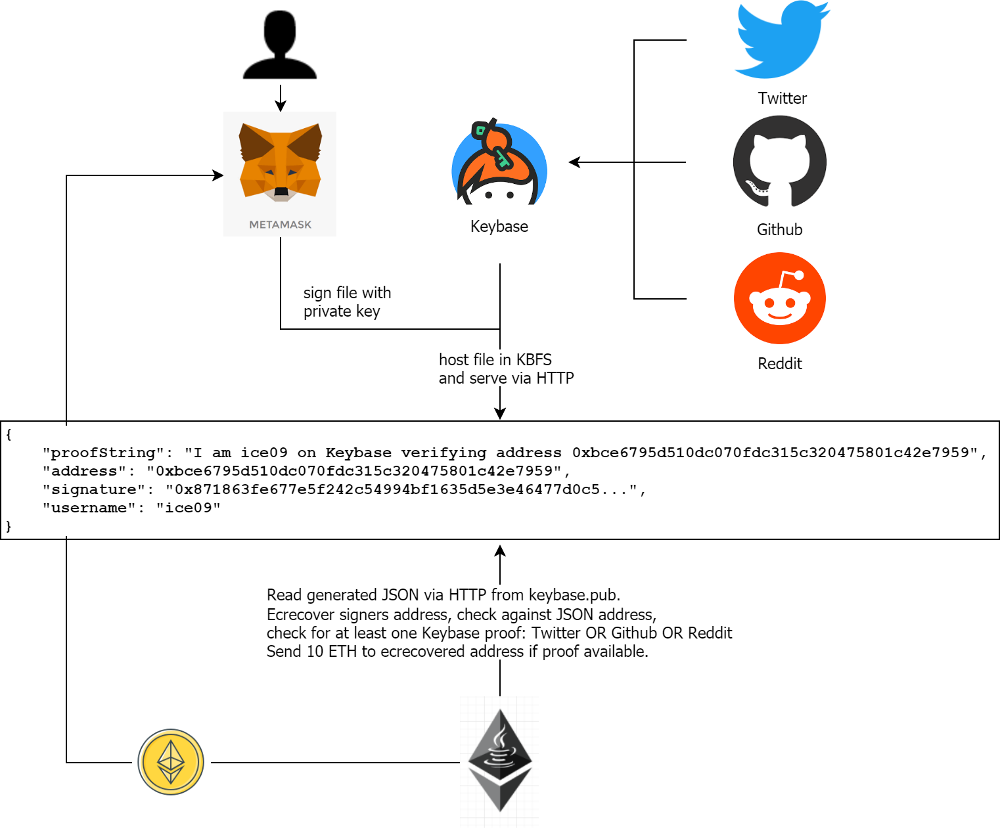

# EIP-712 Onboarding 

Note: The corresponsing blog post is here: http://blockchainers.org/index.php/2018/12/30/invite_me-onboarding-to-ethereum-chains-with-keybase-io-identity-verification-and-eip-712/

In this demo users are identified with either their Twitter, Github or Reddit accounts via Keybase and 
are onboarded (by sending 10 ETH) to a private Ethereum chain.   
The project is based on the corresponsing blog post.  
The project is solely for training purposes, do not use any part in production environments!

# Prerequisites

* Ganache
* Java 8+
* Maven
* optional: Git

# Setup

* Clone project with `git clone` or download the project as a compressed file

# Run

* Start Ganache with mnemonic `candy maple cake sugar pudding cream honey rich smooth crumble sweet treat`
* Build project with `mvn clean package`
* Change to directory target and start application with `java -jar safesig-0.0.1.jar`

# Credentials

## Original EIP712 Signing Demo

This is derived from the demonstration of EIP712 signing support (EIP712 Signing Demo) via MetaMask's `eth_signTypedData_v3` API call.

[Try the original version here.](https://weijiekoh.github.io/eip712-signing-demo/index.html)

You need a version of MetaMask that supports `eth_signTypedData_v3` to use this demo (4.14+).

## Aragon and Keybase

As mentioned in the corresponding blogpost, the original idea is based on blog posts by Aragon and on functionality provided by keybase.io.
